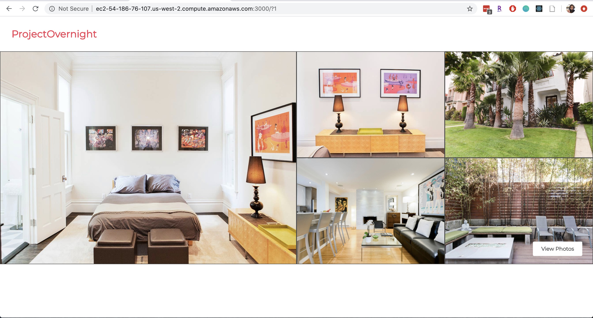

# Project Overnight: Photo Banner Service

A service handling the photo banner to display and allow the user to browse through photos. See a photo grid displaying up to 5 images, whereby hovering over one brings the photo into focus and dimming the others. Click into the photo to see more details and access other images for the record via an image carousel.



## Related Projects
  - Description Service: https://github.com/project-overnight/po-description
  - Reservation Service: https://github.com/project-overnight/po-reservations
  - Reviews Service: https://github.com/project-overnight/po-reviews

## Technologies Used
  - Frontend: React, HTML5, CSS3, jQuery
  - Backend: MongoDB, Express.js, Node.js
  - Deployment: AWS (EC2, S3)

**Install dependencies**
```sh
npm install
```

**Set up environment variables**
- Make a copy of .env_sample to add server host and port details.
- Save as .env and ensure it's added to .gitignore.

**Seed the database**
- In seeder.js, update referencees to your images and insert desired starting number and records to seed by updating createSampleData(startingNumber, numberOfRecords) on line 125.
```sh
npm run seed
```

**Create the build**
```sh
npm run build
```

**Start up the service**
```sh
npm start
```

## Style Guide
This service follows [Airbnb style guide](https://github.com/airbnb/javascript)
